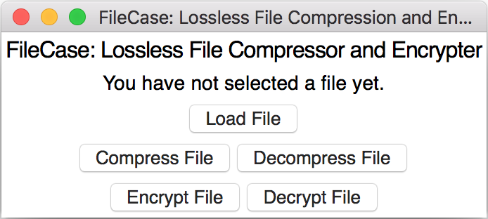
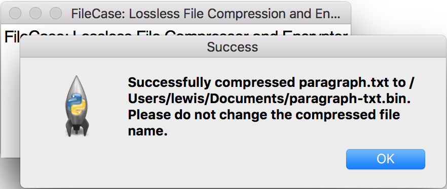
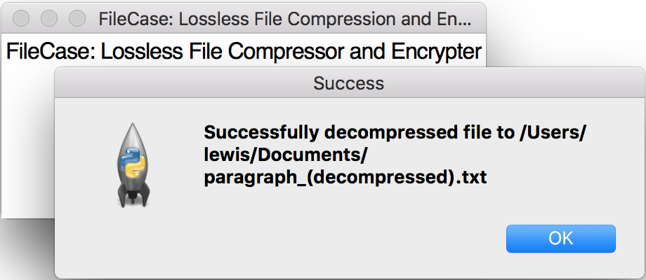
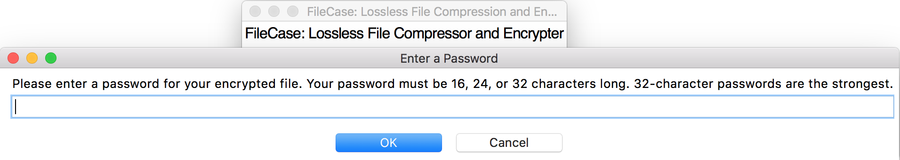
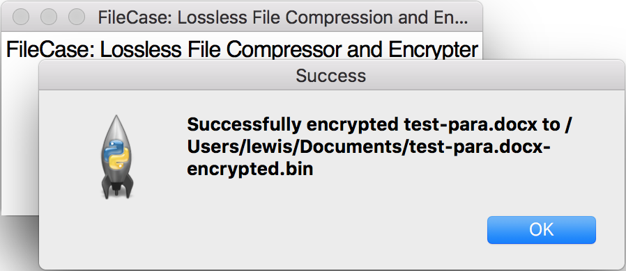
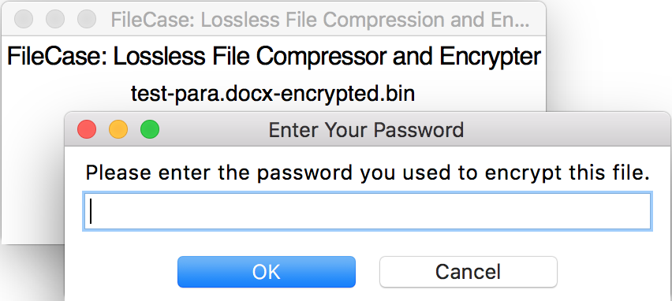
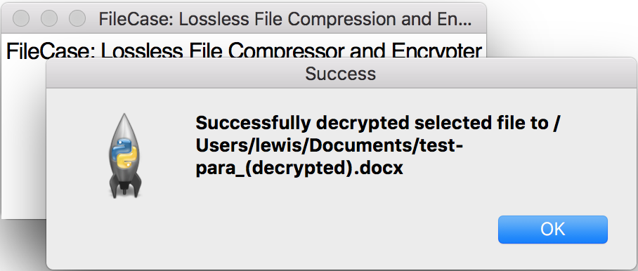

# FileCase: GUI Walkthrough

This page will give you a brief overview of how FileCase works. You will find samples of original files and their compressed/decompressed or encrypted/decompressed versions in [the test folder.](https://github.com/lounotlew/FileCase/tree/master/test)

**Main interface for FileCase.**

The main menu for FileCase. Has options to load a file that the user would compress/decompress or encrypt/decrypt, and buttons that actually compress/decompress or encrypt/decrypt the chosen file. Files to be compressed or encrypted must be ``.txt`` or ``.docx`` files, and will be saved as ``.bin`` files. Files to be decompressed/decrypted must be ``.bin`` files, and will be saved as ``.txt`` or ``.docx`` files, depending on the original file.

 

**Compression/Decompression**

Compressing a file. Saves to a directory the user chooses when they load a file.

 

Decompressing a file. Saves to a directory the user chooses when they load a file.

 

**Encryption/Decryption**

Prompt for a 16, 24, or 32-length password upon selecting encryption.

 

Window after successfully encrypting a file to the user-selected directory.

 

Prompt for the 16, 24, or 32-length password the user chose when they encrypted the file.

 

Window after successfully decrypting a file to the user-selected directory.

 
